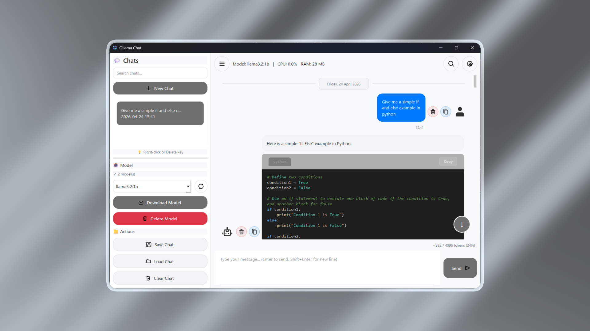

<div align="center">

# 🤖 Ollama Chat GUI

**Десктоп интерфейс за чат с Ollama.**


[](https://github.com/mtn0027/OllamaGui/releases/latest)



</div>

---

## 📋 Нужен софтуер

- **[Ollama](https://ollama.ai)** инсталиран и пуснат — единственото задължително изискване
- Python 3.8+ _(само ако стартирате от изходния код)_

---

## 🚀 Бърз старт

### ▶ Опция 1 — Директно изпълнение (Windows)

1. Свалете `OllamaChat.exe` от [Releases](https://github.com/mtn0027/OllamaGui/releases/latest)
2. Инсталирайте и пуснете [Ollama](https://ollama.ai)
3. Стартирайте `OllamaChat.exe`

> Не е нужен Python или каквито и да е библиотеки.

### 🐍 Опция 2 — От изходния код

**1. Клонирайте или свалете това repo**
```bash
git clone https://github.com/mtn0027/OllamaGui.git
cd ollama-chatbot
```

**2. Инсталирайте нужните библиотеки**
```bash
pip install PyQt6 requests psutil
```

**3. Проверете дали Ollama работи**
- На Windows/Mac: Пуснете Ollama приложението
- На Linux: Изпълнете `ollama serve` в терминала

**4. Пуснете приложението**
```bash
python main.py
```

---

## ⚙️ Първоначална настройка

При първо отваряне на програмата трябва да се изтегли модел:

1. Натиснете бутона **"Download Model"** в страничното меню
2. Изберете модел
3. Изчакайте да се свали

---

## ✨ Функции

| Функция | Описание |
|---|---|
| 💬 Чат сесии | Множество чат сесии с автоматично запазване |
| 🎨 Теми | Тъмна/Светла тема |
| 📥 Модели | Изтегляне на модели чрез интерфейсът |
| 💾 Експорт | Експортиране на чатове като JSON |
| 🎯 Код | Синтаксис хайлайтинг на код в отговорите |
| ⚙️ Настройки | Настройки за температура и други параметри |
| 📊 Ресурси | Следене на използваните RAM и CPU |
| 🔍 Търсене | Търсене на думи в чат |
| 🔍 Филтър | Търсене на чатове по име |
| 🎨 Акценти | Смяна на цвета на акцентите |
| 💾 Запазване | Запазване на настройките |
| ⏳ Индикатор | Анимиран индикатор „Thinking..." докато се изчаква отговор от AI |
| 🌐 Валидация | Проверка за интернет връзка при изтегляне на модели |

---

## ⌨️ Клавишни комбинации

| Клавиш | Действие |
|---|---|
| `Ctrl+N` | Нов чат |
| `Ctrl+S` | Запазване текущия чат |
| `Ctrl+K` | Изчистване чата |
| `Ctrl+B` | Показване/скриване на страничното меню |
| `Ctrl+F` | Търсене на думи в чат |
| `Enter` | Изпращане на съобщение |
| `Shift+Enter` | Нов ред в съобщението |